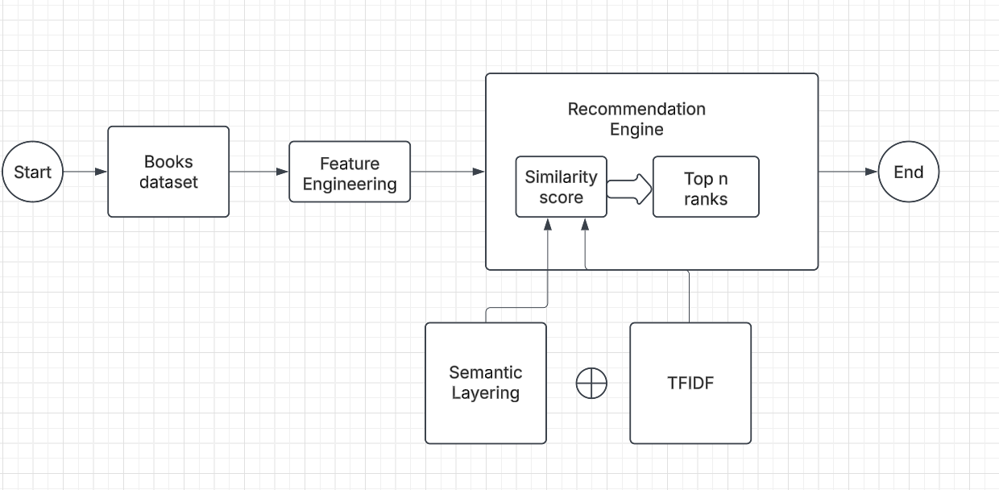

# Content Based Filtering Recommendation System for Google Books

## Foundational concepts
Content Based Filtering: This short tutorial should help you with the basics of recommendation systems: [rec_system](https://www.geeksforgeeks.org/ml-content-based-recommender-system/)

   
## Data details
Please refer to `data_collection/read_data.py` for details on using Google API books dataset using
[this](https://www.googleapis.com/books/v1/volumes?q={query}&maxResults={max_results}&startIndex={start_index})

## What the project does
This recommendation system provides user specified 'n' book recommendations across multiple genres using a Content Based Filtering system. You can refer to this design for a high level walkthrough:

Tokenization of descriptions of books is used to calculate cosine similarity according to which top 'n' books are ranked.

## How to run the project
### NOTE: poetry basics and ML basics are assumed to run this project
After setting up the poetry environment: 
Run recommendation system from: `/the_subtle_art_of_giving_a_flix/rec_engine` as `python end2end.py`
  

